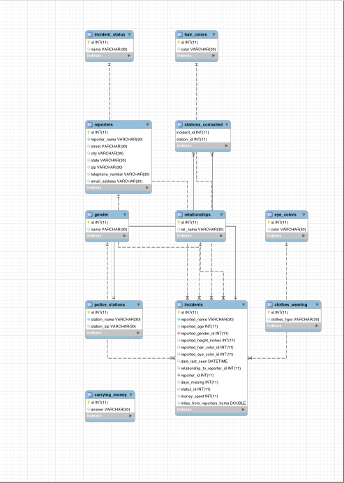
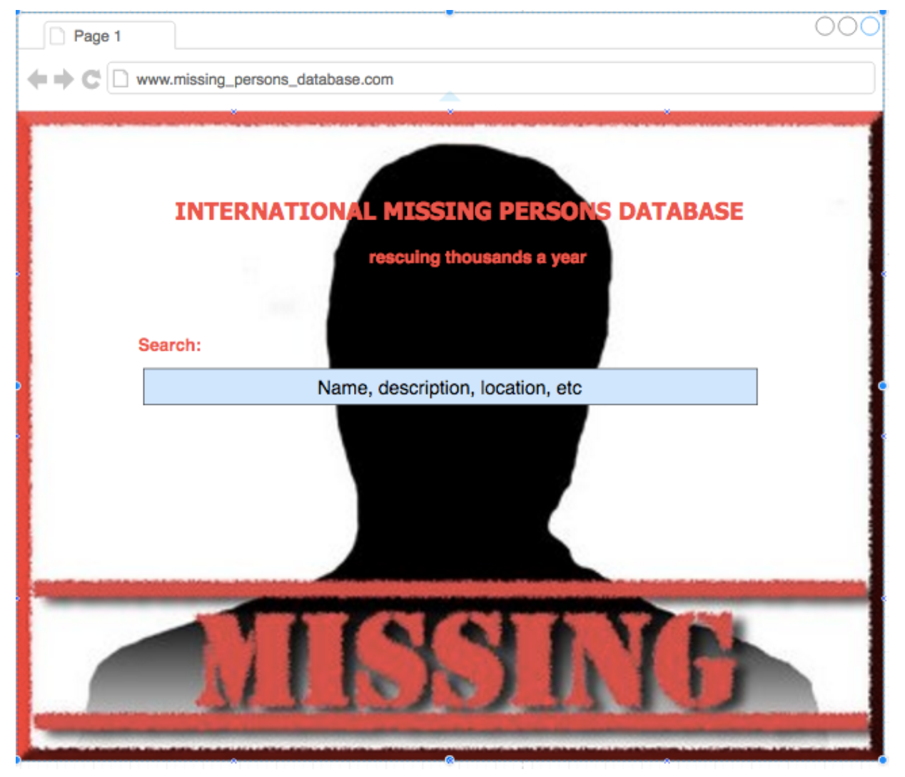
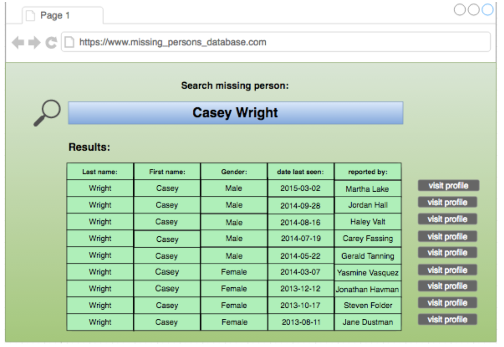
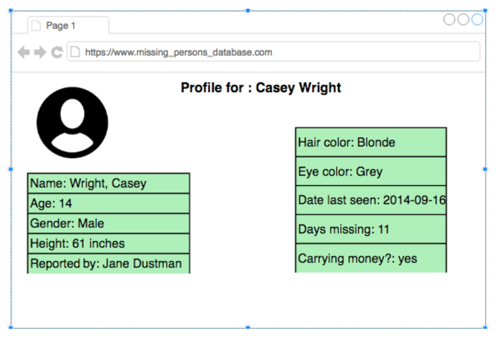
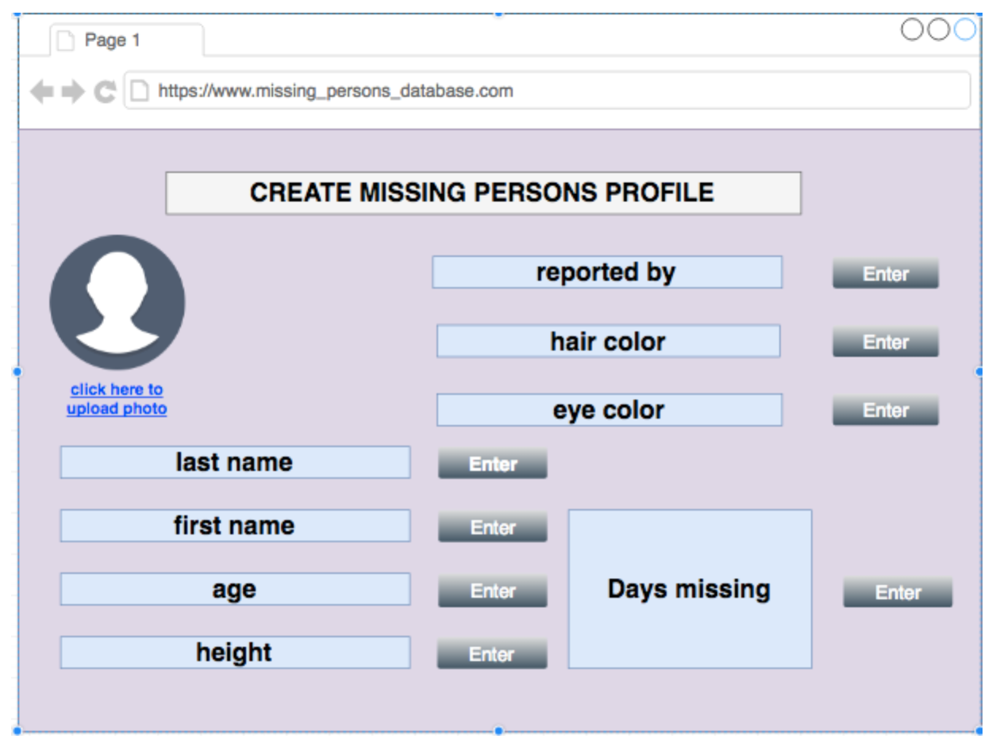
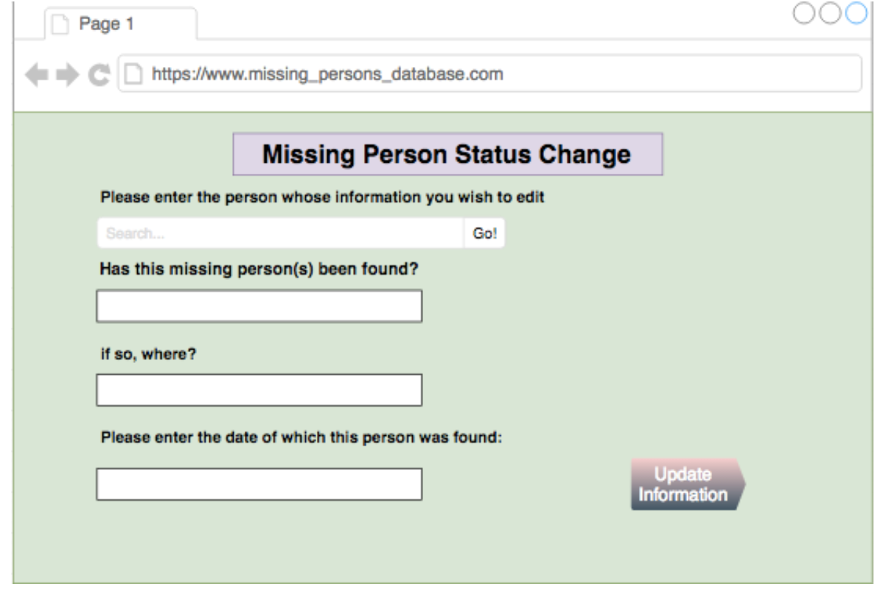

# MissingPersonApp
This is a database to track and search missing persons.

## Why Am I Building This
Every 40 seconds a child goes missing in the US!

Every year 800,000 children are missing in the US alone!

It can take over 2 hours to get information about a missing child from a panicked parent

I feel it is the most horrendous experience for a child and certainly the parents.

## How did I build this

### First the database design
There tables that hold the data are shown in the ER Diagram below

### Then Create the Database and insert some data

<pre>
CREATE DATABASE missing_persons;

USE missing_persons;

-- I created a table called incidents where all details about the missing persons is stored

CREATE TABLE incidents(
id INT PRIMARY KEY NOT NULL auto_increment,
reported_name VARCHAR(30) NOT NULL,
reported_age INT,
reported_gender_id INT NOT NULL,
reported_height_inches INT,
reported_hair_color_id INT,
reported_eye_color_id INT,
date_last_seen DATETIME,
relationship_to_reporter_id INT,
reporter_id INT NOT NULL,
days_missing INT,
status_id INT,
money_spent INT,
miles_from_reporters_home DOUBLE,
reported_clothes_wearing_id INT,
reported_carrying_money_id INT,
FOREIGN KEY (status_id) REFERENCES incident_status(id),
FOREIGN KEY (reported_gender_id) REFERENCES gender(id),
FOREIGN KEY (reporter_id) REFERENCES reporters(id),
FOREIGN KEY (reported_hair_color_id) REFERENCES hair_colors(id),
FOREIGN KEY (reported_eye_color_id) REFERENCES eye_colors(id),
FOREIGN KEY (relationship_to_reporter_id) REFERENCES relationships(id)
);

-- here, I inserted 10 values of data for missing people, and added in the reported_gender_id,

-- relationship_to_reporter_id, reporter_id, and status_id

INSERT INTO incidents(reported_name, reported_age, reported_gender_id, reported_height_inches, date_last_seen,
relationship_to_reporter_id, reporter_id, days_missing, status_id, money_spent, miles_from_reporters_home)
VALUES
('Karla Morris','17','12','62','2014-06-13','11','1','68','7','2500','10'),
('Dylan Smith','16','11','65','2014-07-20','12','2','24','7','1500','27'),
('Katie Shoon','22','12','66','2014-08-22','13','3','55','8','2700','3'),
('Sam Mint','19','11','67','2014-09-15','14','4','16','8','1500','7'),
('Hanna James','16','12','64','2014-10-27','15','5','26','8','2600','15'),
('Spencer Ross','21','11','68','2014-11-12','16','6','22','8','2000','11'),
('Emily Han','18','12','60','2014-12-06','17','7','70','8','3500','6'),
('Ronald Lance','15','11','65','2015-01-09', '18','8','52','7','2200','13'),
('Sarah Carter','13', '12','59','2015-02-08','19','9','15','7','500','30'),
('Casey Wright','14', '11','61','2015-03-02','20','10','11','8','700','33');

-- here, I updated reported_hair_color_id and reported_eye_color_id
UPDATE incidents

SET reported_hair_color_id = 12
WHERE id = 1;

UPDATE incidents
SET reported_hair_color_id = 11
WHERE id = 2;

UPDATE incidents
SET reported_hair_color_id = 13
WHERE id = 3;

UPDATE incidents
SET reported_hair_color_id = 12
WHERE id = 4;

UPDATE incidents
SET reported_hair_color_id = 11
WHERE id = 5;

UPDATE incidents
SET reported_hair_color_id = 13
WHERE id = 6;

UPDATE incidents
SET reported_hair_color_id = 11
WHERE id = 7;

UPDATE incidents
SET reported_eye_color_id = 11
WHERE id = 1;

UPDATE incidents
SET reported_eye_color_id = 12
WHERE id = 2;

UPDATE incidents
SET reported_eye_color_id = 13
WHERE id = 3;

UPDATE incidents
SET reported_eye_color_id = 14
WHERE id = 4;

UPDATE incidents
SET reported_eye_color_id = 11
WHERE id = 5;

UPDATE incidents
SET reported_eye_color_id = 12
WHERE id = 6;

UPDATE incidents
SET reported_eye_color_id = 13
WHERE id = 7;

-- I created a table called reporters for the people who reported the missing persons

-- In this table, all address and contact information is stored

CREATE TABLE reporters(
id INT PRIMARY KEY NOT NULL auto_increment,
reporter_name VARCHAR(30) NOT NULL,
street VARCHAR(30),
city VARCHAR(30),
state VARCHAR(30),
zip VARCHAR(30),
telephone_number VARCHAR(30),
email_address VARCHAR(30)
);

-- I inserted 10 rows of data for reporters of missing persons

INSERT INTO reporters(reporter_name, street, city, state, zip, telephone_number, email_address)
VALUES
('Martha Lake','162 Chestwood Road','Vanderbilt','TN','11234','2124453342', 'marthalake@gmail.com'),
('Jordan Hall','145 Burns Lane','Atlanta','GA','13776','6678546556', 'jordanhall@gmail.com'),
('Haley Valt','194 Greencourt Avenue','Sienna','SC','33453','8899976687', 'haleyvalt@gmail.com'),
('Carey Fassing','889 Hart Road','Seattle','WA','77562','3342232223', 'careyfassing@gmail.com'),
('Gerald Tanning','562 Redwood Lane','Topeka','KS','56098','8211345321', 'gerardtanning@gmail.com'),
('Yasmine Vasquez','544 Castle Court','San Diego','CA','68231','9872156242', 'yasminevasquez@gmail.com'),
('Jonathan Haveman','335 Dartwood Road','Madison','WA','65678','4409872332', 'jonathanhaveman@gmail.com'),
('Steven Folder','134 Barnes Avenue','Salt Lake City','UT','66721','7475664354', 'stevenfolder@gmail.com'),
('Horace King','774 Carter Road','Lansing','MI','85564','2343113141', 'horaceking@gmail.com'),
('Jane Dustman','652 Lawrence Lane','Houston','TX','92323','8776990786', 'janedustman@gmail.com');

-- I created a table called police_stations where each police station id, name, and zip code is stored

CREATE TABLE police_stations(
id INT PRIMARY KEY NOT NULL auto_increment,
station_name VARCHAR(30) NOT NULL,
station_zip VARCHAR(30)
);

-- I inserted 5 rows of data with possible names and zip codes

INSERT INTO police_stations(station_name, station_zip)
VALUES
('Hawkins','223421'),
('Jamesville','76588'),
('Knoxville','23245'),
('Newton','53567'),
('Carlsburg','67342');

INSERT INTO police_stations(station_name, station_zip)
VALUES
('San Antonio','35563'),
('Palo Alto','41121'),
('Princeton','18817'),
('Raleigh','90723'),
('Tallahassee','67543');

-- I created a junction table that contains the incident id and the police station id

CREATE TABLE stations_contacted(
incident_id INT NOT NULL,
station_id INT NOT NULL,
FOREIGN KEY (incident_id) REFERENCES incidents(id),
FOREIGN KEY (station_id) REFERENCES police_stations(id),
PRIMARY KEY (incident_id, station_id)
);

-- here, I inserted id's to assign incidents to police stations

INSERT INTO stations_contacted(incident_id, station_id)
VALUES
(1,3),
(4,5),
(2,2),
(1,5),
(3,5);

INSERT INTO stations_contacted(incident_id, station_id)
VALUES
(2,3),
(4,2),
(1,2),
(2,5),
(3,3);

-- I created a table to give each eye color an id

CREATE TABLE eye_colors(
id INT PRIMARY KEY NOT NULL auto_increment,
color VARCHAR(30)
);

-- I put 4 rows of data for all possible eye colors that missing people could have

INSERT INTO eye_colors(color)
VALUES
('Blue'),
('Brown'),
('Green'),
('Grey');

-- here, I created a table called relationships for all of the relationships reporters could have with..

-- ..the people that they reported missing

CREATE TABLE relationships(
id INT PRIMARY KEY NOT NULL auto_increment,
rel_name VARCHAR(30)
);

-- these are 10 values that reporters are most likey to have with the people they reported missing

INSERT INTO relationships(rel_name)
VALUES
('Mother'),
('Father'),
('Sister'),
('Brother'),
('Wife'),
('Neighbor'),
('Friend'),
('Coworker'),
('Husband'),
('Teacher');

-- these are 10 possible types of clothing that the missing person could have been wearing
-- when they were reported missing

CREATE TABLE clothes_wearing(
id INT PRIMARY KEY NOT NULL auto_increment,
clothes_type VARCHAR(30)
);

INSERT INTO clothes_wearing(clothes_type)
VALUES
('sweatshirt'),
('sweatpants'),
('t-shirt'),
('coat'),
('jersey'),
('jeans'),
('dress'),
('skirt'),
('shorts'),
('scarf');

CREATE TABLE carrying_money(
id INT PRIMARY KEY NOT NULL auto_increment,
answer VARCHAR(30)
);

-- whether or not the person was carrying money on them when they went missing

INSERT INTO carrying_money(answer)
VALUES
('yes'),
('no');
-- I created a table called hair_colors for all hair colors the missing persons could most likely have

CREATE TABLE hair_colors(
id INT PRIMARY KEY NOT NULL auto_increment,
color VARCHAR(30)
);

-- I found these 3 values to be the most common hair colors

INSERT INTO hair_colors(color)
VALUES
('Brown'),
('Black'),
('Blonde');

-- I created incident_status to create an id to determine if the missing person had been found yet

CREATE TABLE incident_status(
id INT PRIMARY KEY NOT NULL auto_increment,
name VARCHAR(30)
);

-- these values determine if the person is still missing -> 'open' or has been found -> 'closed'

INSERT INTO incident_status(name)
VALUES
('Open'),
('Closed');

-- I created the gender table to make an id to summarize what gender the missing person is

CREATE TABLE gender(
id INT PRIMARY KEY NOT NULL auto_increment,
name VARCHAR(30)
);

-- the only two values that can be put into the database are 'male' and 'female'

INSERT INTO gender(name)
VALUES
('Male'),
('Female');

SELECT * FROM incidents;
SELECT * FROM police_stations;
SELECT * FROM stations_contacted;
SELECT * FROM gender;
SELECT * FROM hair_colors;
SELECT * FROM eye_colors;

</pre>

### What questions will my data base answer?

###### Find all females who are still missing AND live less than 40 miles from their reporter's home

<pre>
SELECT *
FROM incidents AS inc
INNER JOIN incident_status AS sta
ON inc.status_id = sta.id
INNER JOIN gender
ON inc.reported_gender_id = gender.id
WHERE inc.miles_from_reporters_home < 40
AND sta.name = 'Open'
AND gender.name = 'Female';
</pre>

###### Find a missing person called 'Hanna James' in this database

<pre>
SELECT * FROM incidents
WHERE reported_name = 'Hanna James';
</pre>

###### List any 3 missing people's names

<pre>
SELECT incidents.reported_name
FROM incidents
LIMIT 3;
</pre>

###### Find the number of incidents reported in EACH police station

<pre>
SELECT pol.id, pol.station_name, COUNT(*)
FROM police_stations AS pol
INNER JOIN stations_contacted AS sc
ON pol.id = sc.station_id
GROUP BY pol.id, pol.station_name;
</pre>

###### List ALL stations that have more than ONE incident reported

<pre>
SELECT pol.id, pol.station_name, COUNT(*)
FROM police_stations AS pol
INNER JOIN stations_contacted AS sc
ON pol.id = sc.station_id
GROUP BY pol.id, pol.station_name
HAVING COUNT(*) > 1;
</pre>

###### List all missing people in the order of the MOST days missing to the LEAST days missing

<pre>
SELECT incidents.reported_name, incidents.days_missing
FROM incidents
ORDER BY incidents.days_missing
DESC;
</pre>

###### Find the OLDEST person missing in EACH police station

<pre>
SELECT ps.id, ps.station_name, MAX(inc.reported_age)
FROM police_stations AS ps
INNER JOIN stations_contacted AS sc
ON ps.id = sc.station_id
INNER JOIN incidents AS inc
ON inc.id = sc.incident_id
GROUP BY ps.id, ps.station_name;
</pre>

###### Show me all incidents

<pre>
SELECT *
FROM hair_colors AS hc
LEFT JOIN incidents AS inc
ON inc.reported_hair_color_id = hc.id;
</pre>

###### Name all missing people who have either BLACK or BROWN eyes

<pre>
SELECT inc.reported_name
FROM incidents AS inc
WHERE reported_eye_color_id IN(
SELECT id
FROM hair_colors
WHERE color IN('brown','black')
);
</pre>

###### Find at least ONE person who has grey eyes

<pre>
SELECT reported_name
FROM incidents
WHERE reported_eye_color_id = 14
LIMIT 1;
</pre>

## How will my users use my application

I will make a web site that is based on my database.

Below is the user interface (UI) of my application

##### Main Page

Here, the person would be able to search any information that they have on a missing person,
and return thousands of international results.

One of the examples from my data is a boy named Casey Wright. If someone were to search for Casey,
they would be able to see all of these results, including details such as gender, date last seen, and who they were reported by.
Suppose someone recognizes the date last seen or the reporter. They would then click on the name, and their profile will come up:

Here, more details and a photo will come up. People who have more information or who are interested in the case will then be able to contact the station involved in the case.

Here is an example of what it would look like for a parent/police officer to fill out a missing persons profile:

When a missing person’s status changes, one can edit their profile like this:
Therefore, if that person is searched, it will be shown that they were found along with details.

